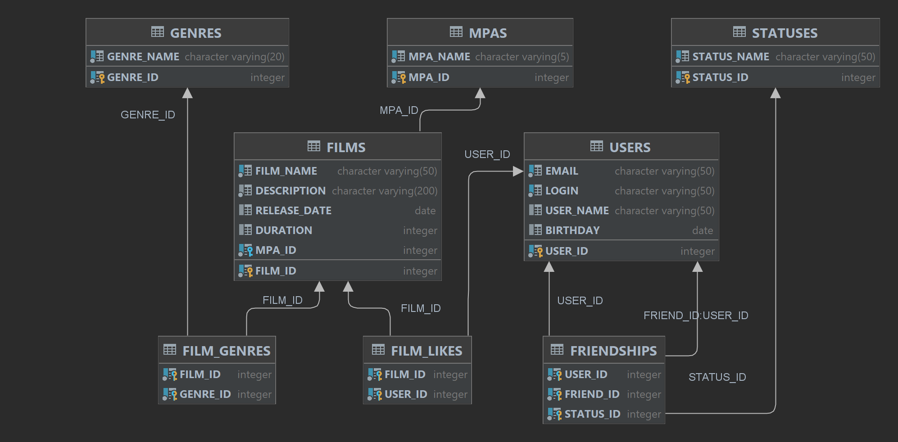

# ER-диаграмма проекта Filmorate с описанием

## Диаграмма:

> 

## Текстовая часть (схема) диаграммы:

```
CREATE TABLE IF NOT EXISTS USERS (
  USER_ID   INTEGER GENERATED BY DEFAULT AS IDENTITY PRIMARY KEY,
  EMAIL     VARCHAR(50) UNIQUE NOT NULL,
  LOGIN     VARCHAR(50) UNIQUE NOT NULL,
  USER_NAME VARCHAR(50),
  BIRTHDAY  DATE
);

CREATE TABLE IF NOT EXISTS STATUSES (
  STATUS_ID   INTEGER GENERATED BY DEFAULT AS IDENTITY PRIMARY KEY,
  STATUS_NAME VARCHAR(50) UNIQUE NOT NULL
);

CREATE TABLE IF NOT EXISTS FRIENDSHIPS (
  USER_ID   INTEGER NOT NULL,
  FRIEND_ID INTEGER NOT NULL,
  STATUS_ID INTEGER NOT NULL,
  PRIMARY KEY (USER_ID, FRIEND_ID, STATUS_ID)
);
ALTER TABLE FRIENDSHIPS ADD CONSTRAINT FK_USER_USERS      FOREIGN KEY (USER_ID)   REFERENCES USERS (USER_ID);
ALTER TABLE FRIENDSHIPS ADD CONSTRAINT FK_FRIEND_USERS    FOREIGN KEY (FRIEND_ID) REFERENCES USERS (USER_ID);
ALTER TABLE FRIENDSHIPS ADD CONSTRAINT FK_STATUS_STATUSES FOREIGN KEY (STATUS_ID) REFERENCES STATUSES (STATUS_ID);

CREATE TABLE IF NOT EXISTS MPAS (
  MPA_ID   INTEGER GENERATED BY DEFAULT AS IDENTITY PRIMARY KEY,
  MPA_NAME VARCHAR(5) UNIQUE NOT NULL
);

CREATE TABLE IF NOT EXISTS FILMS (
  FILM_ID      INTEGER GENERATED BY DEFAULT AS IDENTITY PRIMARY KEY,
  FILM_NAME    VARCHAR(50) UNIQUE NOT NULL,
  DESCRIPTION  VARCHAR(200) NOT NULL,
  RELEASE_DATE DATE,
  DURATION     INTEGER,
  MPA_ID       INTEGER NOT NULL
);
ALTER TABLE FILMS ADD CONSTRAINT FK_FILMS_MPAS FOREIGN KEY (MPA_ID) REFERENCES MPAS (MPA_ID);

CREATE TABLE IF NOT EXISTS GENRES (
  GENRE_ID   INTEGER GENERATED BY DEFAULT AS IDENTITY PRIMARY KEY,
  GENRE_NAME VARCHAR(20) UNIQUE NOT NULL
);

CREATE TABLE IF NOT EXISTS FILM_GENRES (
  FILM_ID  INTEGER NOT NULL,
  GENRE_ID INTEGER NOT NULL,
  PRIMARY KEY (FILM_ID, GENRE_ID)
);
ALTER TABLE FILM_GENRES ADD CONSTRAINT FK_FG_FILMS   FOREIGN KEY (FILM_ID)  REFERENCES FILMS (FILM_ID);
ALTER TABLE FILM_GENRES ADD CONSTRAINT FK_FG_GENRES  FOREIGN KEY (GENRE_ID) REFERENCES GENRES (GENRE_ID);

CREATE TABLE IF NOT EXISTS FILM_LIKES (
  FILM_ID INTEGER NOT NULL,
  USER_ID INTEGER NOT NULL,
  PRIMARY KEY (FILM_ID, USER_ID)
);
ALTER TABLE FILM_LIKES ADD CONSTRAINT FK_FL_FILMS FOREIGN KEY (FILM_ID) REFERENCES FILMS (FILM_ID);
ALTER TABLE FILM_LIKES ADD CONSTRAINT FK_FL_USERS FOREIGN KEY (USER_ID) REFERENCES USERS (USER_ID);
```

## Описание:

1) Основные сущности проекта - пользователи (таблица users) и фильмы (таблица films).
2) Пользователи могут подружиться (таблица friendship), а также отмечать фильмы лайком.
3) Факт запроса дружбы отмечается записью с id потенциальных друзей, а также статусом "Waiting".
4) Факт подтверждения дружбы фиксируется изменением статуса с "Waiting" на "Confirmed".
5) Факт отказа от дружбы фиксируется удалением записи с id пользователей.
6) Фильмы имеют возрастной рейтинг, а также перечень жанров (таблица film_genres).
7) Фильмы, отмеченные лайками пользователей, хранятся в таблице film_like.

## Примеры запросов к БД.

### Получить названия всех фильмов, отсортированные по дате релиза (от старых к новым):

    SELECT films.name, films.release_date
    FROM films
    ORDER BY release ASC;

### Получить имена всех пользователей, отсортированные по возрасту (от младшего к старшему):

    SELECT users.name
    FROM users
    ORDER BY users.birthday DESC;

### Получить ТОП-5 наиболее популярных фильмов (с наибольшим количеством лайков):

    SELECT films.name, COUNT(likes.film_id)
    FROM films
    LEFT JOIN film_like AS likes ON films.id = likes.film_id
    GROUP BY films.name, likes.film_id
    HAVING COUNT(likes.film_id) > 0
    ORDER BY
    COUNT(likes.film_id) DESC
    LIMIT 5;

### Получить список имён общих подтверждённых друзей пользователей с id=1 и id=3:

    (SELECT friendship.friend_id
    FROM friendship
    WHERE friendship.user_id = 1 AND friendship.status_id = 2)
    INTERSECT
    (SELECT friendship.friend_id
    FROM friendship
    WHERE friendship.user_id = 3 AND friendship.status_id = 2)