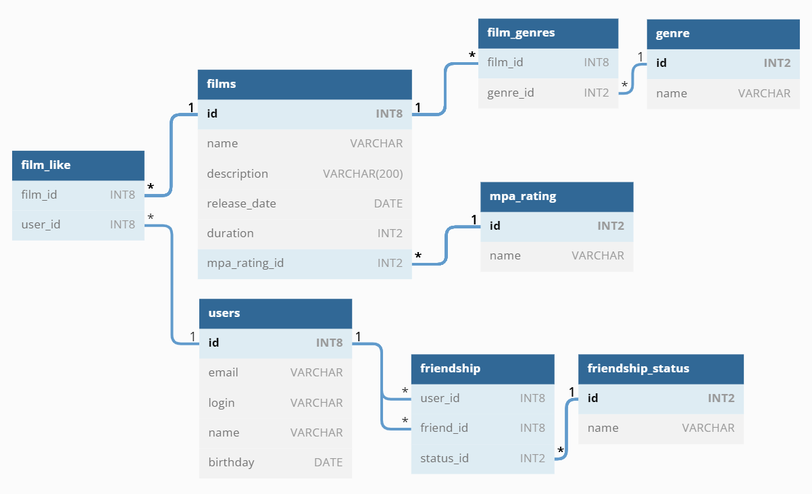

# ER-диаграмма проекта Filmorate с описанием

## Диаграмма:

> 

## Описание:

1) Основные сущности проекта - пользователи (таблица users) и фильмы (таблица films).
2) Пользователи могут подружиться (таблица friendship), а также отмечать фильмы лайком.
3) Факт запроса дружбы отмечается записью с id потенциальных друзей, а также статусом "Waiting".
4) Факт подтверждения дружбы фиксируется изменением статуса с "Waiting" на "Confirmed".
5) Факт отказа от дружбы фиксируется удалением записи с id пользователей.
6) Фильмы имеют возрастной рейтинг, а также перечень жанров (таблица film_genres).
7) Фильмы, отмеченные лайками пользователей, хранятся в таблице film_like.

## Примеры запросов к БД.

### Получить названия всех фильмов, отсортированные по дате релиза (от старых к новым):

    SELECT films.name, films.release_date
    FROM films
    ORDER BY release ASC;

### Получить имена всех пользователей, отсортированные по возрасту (от младшего к старшему):

    SELECT users.name
    FROM users
    ORDER BY users.birthday DESC;

### Получить ТОП-5 наиболее популярных фильмов (с наибольшим количеством лайков):

    SELECT films.name, COUNT(likes.film_id)
    FROM films
    LEFT JOIN film_like AS likes ON films.id = likes.film_id
    GROUP BY films.name, likes.film_id
    HAVING COUNT(likes.film_id) > 0
    ORDER BY
    COUNT(likes.film_id) DESC
    LIMIT 5;

### Получить список имён общих подтверждённых друзей пользователей с id=1 и id=3:

    (SELECT friendship.friend_id
    FROM friendship
    WHERE friendship.user_id = 1 AND friendship.status_id = 2)
    INTERSECT
    (SELECT friendship.friend_id
    FROM friendship
    WHERE friendship.user_id = 3 AND friendship.status_id = 2)